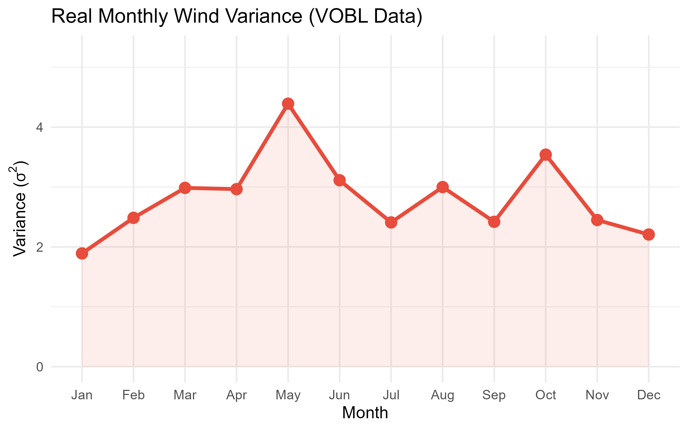

# Stochastic Airspeed Optimization for Urban Air Mobility 🚁⚡


## Overview
This repository contains the R codebase and methodology for a PPDAC (Problem, Plan, Data, Analysis, Conclusion) report focused on optimizing the energy consumption of Electric Vertical Takeoff and Landing (eVTOL) air taxis operating in Bangalore, India. 

## Problem Statement
Urban Air Mobility (UAM) relies on highly battery-constrained eVTOL aircraft. Environmental factors, particularly wind speed and direction, are highly stochastic and drastically impact energy consumption. This project builds a solver model to optimize airspeed across designated routes under unpredictable meteorological conditions.

## Methodology & Features
* **Data Wrangling:** Cleaned and processed real-world meteorological dataset (`VOBL.csv`) using `dplyr` to isolate headwind vectors and calculate monthly wind variances.
* **Statistical Modeling:** Evaluated the real mean ($\mu$) and variance ($\sigma^2$) of headwind distributions to construct a probabilistic environmental model.
* **Convex Optimization:** Developed an expected energy objective function and utilized the `L-BFGS-B` algorithm via R's `optim` function to dynamically determine the most energy-efficient airspeed across three Bangalore flight corridors.
* **Data Visualization:** Generated high-quality density and variance plots using `ggplot2` to visually validate the stochastic wind modeling.

## Tech Stack
* **Language:** R
* **Libraries:** `ggplot2`, `dplyr`, `lubridate`
* **Core Concepts:** Convex Optimization, Stochastic Modeling, Data Engineering, Applied Statistics

## Results & Visualizations



## How to Run
1. Clone the repository:
   ```bash
   git clone https://github.com/sivalakshmiveesamin-code/evtol-stochastic-airspeed-optimization.git

1. Ensure you have the necessary R packages installed (ggplot2, dplyr, lubridate).
2. Make sure VOBL.csv is in the same directory as the script.
3. Run the script via your preferred IDE (RStudio) or command line:
```bash
Rscript optimize_route.R
